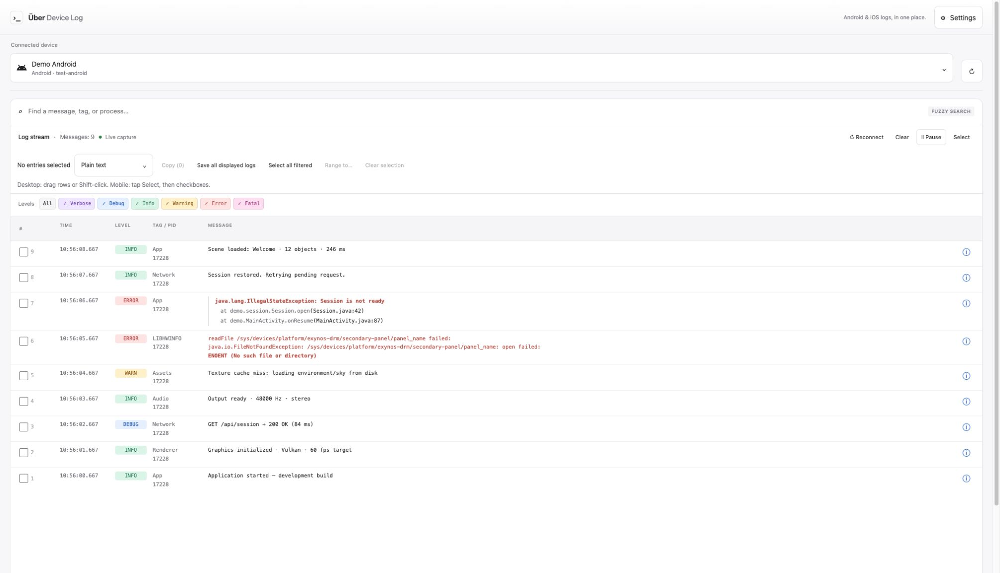
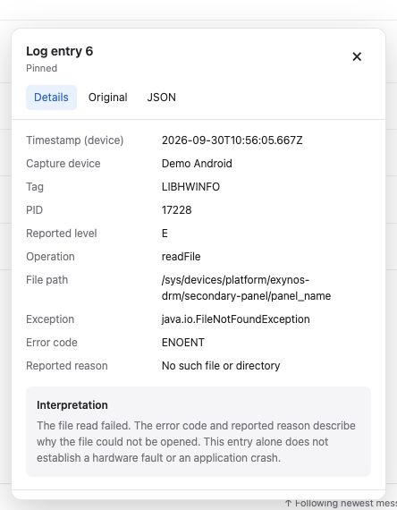
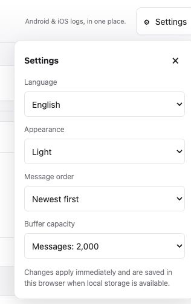

<div align="center">

# Über Device Log

**Android Logcat & iOS syslog, in one place.**

A local browser-based **Android Logcat and iOS syslog viewer**, with setup guidance
for **macOS, Windows and Linux**. Connect a phone, find the message that matters,
and share the relevant entries as plain text or structured JSON.

[Website](https://pmelch.github.io/uber-device-log/) · [Get started](#get-started) · [Connect a device](#connect-a-device) · [Using the viewer](#using-the-viewer) · [Documentation](#documentation)

**Android + iOS** · **Runs locally** · **Six languages** · **Apache-2.0**

</div>



*Actual app screenshots with fictional demo logs.*

## Less searching. More understanding.

| Find what matters | Read at your own pace | Share useful context |
| --- | --- | --- |
| Search messages, tags, timestamps and PIDs. Combine search with Android severity filters. | Pause the view, inspect formatted exceptions, and open structured message details. | Select whole entries and copy or save them as plain text or JSON. |

No account or cloud service. Logs are viewed locally in your browser, with a
responsive interface and System, Light and Dark appearance options.

## Get started

**Minimum Node.js version: 22.12.0.** A browser and the device setup below are also required.
Node.js must be installed and available on `PATH`, including when launching with `bunx`.
Check your installed version with `node --version`.

> **Release status:** The npm package is prepared but has not been published yet.
> Until the first release, use [Run from source](#run-from-source).
> The following package commands become available after publication.

Run without a global installation:

```sh
npx uber-device-log
# or
bunx uber-device-log
```

Prefer a short command? Install once:

```sh
npm install --global uber-device-log
udl
```

Bun users can install with `bun add --global uber-device-log`, then run `udl`.
The package name is `uber-device-log`; its commands are `udl` and `uber-device-log`.

Open **http://127.0.0.1:4310** (or the URL printed in your terminal).
Press **Ctrl+C** in the terminal to stop the server.

```sh
udl --port 4311   # Choose another port
udl --help        # Show available options
udl --version     # Show the installed version
```

With a one-off launcher, use `npx uber-device-log --port 4311` or
`bunx uber-device-log --port 4311`. Both require Node.js; omit Bun's `--bun` flag.

### Run from source

```sh
git clone https://github.com/PMelch/uber-device-log.git
cd uber-device-log
npm ci
npm run dev
```

Open **http://127.0.0.1:4310**. See the [technical guide](docs/technical.md#run)
for production builds and development commands.

## Connect a device

On wide screens, choose a device from the left sidebar. On narrower screens,
use the device menu above the logs.

The app remembers the last selected device. On reload, it selects that device and
starts capture if it is connected and available. Otherwise the selection stays
empty, while the saved device is retained for a later reload. Reattaching it
during an open session does not automatically start capture.

### Android Logcat on macOS, Windows and Linux

The viewer captures Android Logcat through ADB (`adb logcat`), including severity,
tag, process ID and stack traces. Install the Platform Tools for your host OS;
Android Studio does not need to be running.

1. Install Android SDK Platform Tools and make `adb` available on your `PATH`.
2. Enable **USB debugging** on your device and connect it to your computer.
3. Accept the device's debugging authorization prompt.
4. Choose the device in **Connected device**.

Devices already visible to ADB, including Android emulators, may also appear.
If your ADB executable lives elsewhere, set `ADB_PATH` to its path.

### iOS syslog on macOS, Windows and Linux

For iPhone and iPad, the viewer reads **iOS syslog** through the legacy
`com.apple.syslog_relay` service. This provides device logs rather than full parity
with Apple’s unified logging in Console or Xcode. Available output depends on the
device and iOS version; no separate `idevicesyslog` command is required.

1. Connect and unlock your device.
2. Accept **Trust This Computer** and complete pairing.
3. Choose the device in **Connected device**.

On macOS, the app uses the system's Apple device service. Linux needs `usbmuxd`;
Windows needs compatible Apple mobile-device support. macOS is the primary
validation environment; Windows/Linux and physical-device capture still need
validation. No Appium server is required. iOS simulators are not listed.

## Using the viewer

### Find a message

Type in **Filter logs** to search message text and metadata. Use Android's severity
buttons to narrow the view further. Change **Message order** in **Settings** to show newest entries
first or last. Scrolling away stops automatic following; **Follow latest** resumes it.

### Pause, inspect, resume

**Pause** freezes the view while capture continues. **Back to live** is gently
highlighted while paused; click it to resume and clear your selection.

Hover over an entry's **ⓘ** button to inspect its metadata and interpretation.
The card offers **Details**, **Original**, and **JSON** views. Click the info button
again or use **×** to close it. Scrolling the list or selecting a row also closes it.
Explanations describe patterns in the message; they are not definitive diagnoses.



### Copy or save

1. Select entries: click, drag a range, **Shift-click** to extend, or **Ctrl/Cmd-click**
   to toggle. On mobile, tap **Select** and use the checkboxes.
2. Choose **Plain text** or **Structured JSON**.
3. Click **Copy** or **Save**.

Selecting entries freezes the view so you can work without incoming messages
moving the selection. **Select all filtered** selects the current results.
Without a selection, **Save all displayed logs** saves the filtered view.
Exports preserve whole entries, metadata and multiline messages in display order.

### Choose your language

**English · Español · Deutsch · Français · Italiano · 简体中文**

Open **Settings** in the header to choose your language, appearance, message order,
and buffer capacity. All four preferences are saved locally in this browser;
System appearance follows your operating system. Changes apply immediately, and
remain usable for the session if browser storage is blocked.



Your preferences survive reloads; captured logs are not saved. As always,
original log messages and technical values are never translated.

## Good to know

- **Clear** empties the viewer, not the device's logs.
- The buffer defaults to **2,000 messages**, with options up to **100,000**.
  Older entries are discarded when the buffer fills. This is a viewer, not a
  lossless recorder; heavy traffic and long messages can be truncated or dropped.
- iOS uses the legacy syslog relay. It may show fewer messages than Apple Console
  or Xcode, and displayed timestamps represent receipt on your computer.
- Disconnects stop capture. Reconnect the device and click **Reconnect** to continue.
- The server listens on your computer's loopback address only. Mobile layouts
  are supported, but the app does not provide remote network access.

<details>
<summary><strong>Troubleshooting</strong></summary>

**The device is missing or unavailable**

Unlock it, check its cable, and accept its trust/debugging prompt. Refresh the device
list. For Android, check that `adb devices` lists the device as authorized. For iOS,
confirm host pairing and the required Apple device services.

**The port is already in use**

Stop the previous app process, or use `udl --port 4311`. When running from source,
set the `PORT` environment variable instead.

**`udl` is not found after installation**

Ensure your package manager's global executable directory is on `PATH`.
Bun normally uses `~/.bun/bin`. Alternatively, launch with `npx uber-device-log`.

**Some iOS logs are missing**

The legacy relay does not guarantee parity with unified logging. See the
[capture limits](docs/technical.md#behavior-and-limits) before relying on completeness.

</details>

## Documentation

| Guide | What's inside |
| --- | --- |
| [Technical documentation](docs/technical.md) | Development setup, architecture, API, export schema and capture limits |
| [Contributing](CONTRIBUTING.md) | Local checks, translation requirements and change guidelines |
| [Localization](docs/localization.md) | Six-language workflow and translation context |
| [Publishing](docs/publishing.md) | Package verification and release steps |
| [Design reference](docs/design/README.md) | Visual design and interface conventions |
| [Crash-format research](docs/crash-format-research.md) | Recognized diagnostic formats and their limits |

Found a problem? [Open an issue](https://github.com/PMelch/uber-device-log/issues)
with your host OS, device platform, app version, and steps to reproduce. Remove
private information before sharing log excerpts.

## License

[Apache License 2.0](LICENSE).
